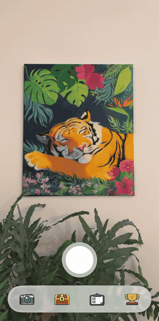
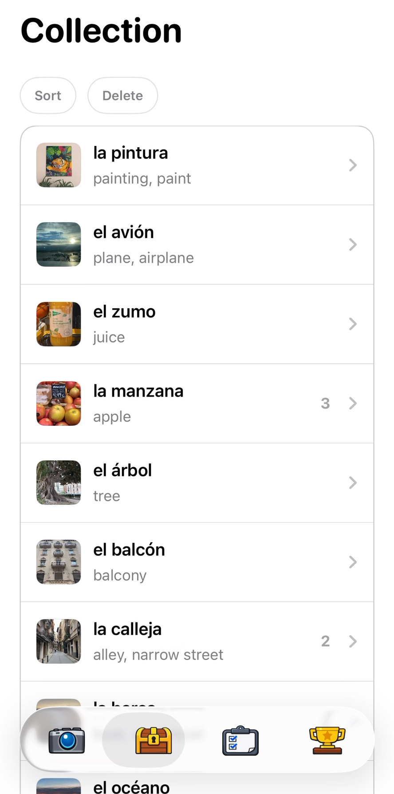
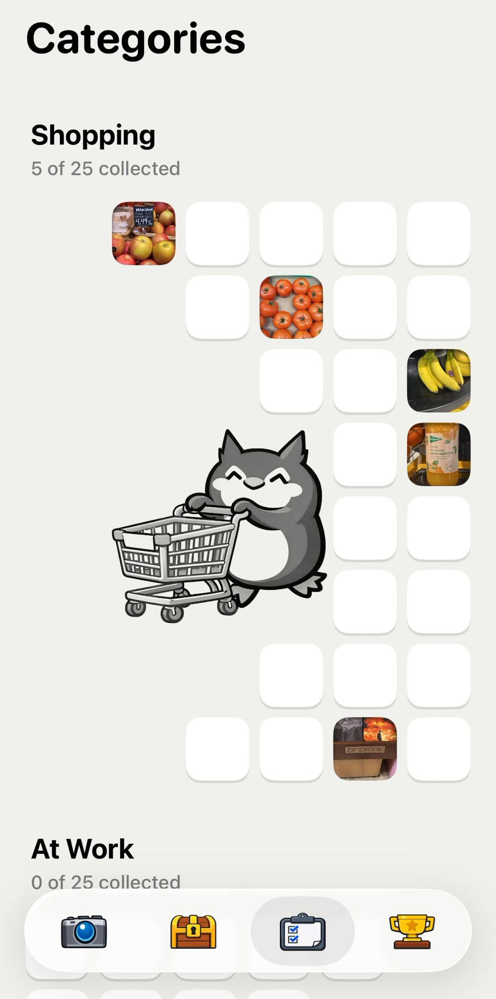
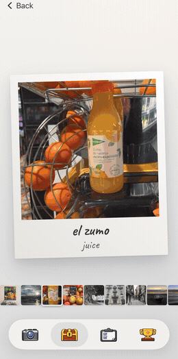

# Word Hunter

Word Hunter is a Spanish vocabulary app built as a photography scavenger hunt. Point your camera at something. The app reads any text in the scene, recognises the objects, and offers you the Spanish words for what it found. Whatever you keep becomes a polaroid that pairs the photo with the word and the place you found it.

**Winner, Apple Swift Student Challenge 2026** · iOS 18+ · SwiftUI + SwiftData · 11.5k lines · no network, no accounts

<p align="center">
  
  
  
</p>

**Scan** a scene and words arrive from three sources. Vision recognises the objects in frame (`el perro`) and reads any text it can see (`la salida`). An on-device language model then suggests verbs and adjectives that go with them (`ladrar`, `suave`). **Collect** the ones you want. Scanning *gato* again across town adds a second photo to that word rather than creating a duplicate. **Hunt** through five categories of 25 words, laid out as empty boxes that your photos fill in one by one. **Unlock** 17 achievements. *Touch Grass* needs a hand and grass in the same shot. *Early Bird* requires a scan between 4 and 6 AM. *Déjà Vu* asks for one word photographed in three places at least 500 m apart. Several of them can only be finished outdoors.

## Architecture

### Scan pipeline

The three recognisers return at very different speeds. Image classification comes back in a fraction of the time `.accurate` OCR needs, and the language model is slower than either. [`ScanPipeline`](App/Scan/ScanPipeline.swift) therefore runs them as separate stages, and the result sheet renders each one as it arrives instead of waiting for the slowest. The captured photo is JPEG-encoded once and the same bytes go to both Vision requests.

The pipeline is assembled from five small protocols (`ScanSource`, `LexiconResolving`, `CandidateRanker`, `DisplayStrategy`, `TokenNormalizing`). That is what makes Demo Mode possible. It substitutes one of them for the single Vision request the Simulator cannot run, and leaves the rest of the pipeline live. See [Running it](#running-it).

The camera view behind the sheet is never torn down. A single `DataScannerViewController` lives for the lifetime of the app, and the tab shell is a `ZStack` whose tabs toggle opacity and hit-testing rather than being inserted and removed. Swapping them conditionally would stop and restart the camera on every tab change, which is slow enough to be visible.

### Ranking and display

Each section of the result sheet has to answer two questions. What order should the words appear in, and how many of them should be visible before the "Show N more" button. [`CandidateRanker`](App/Scan/ResultRanking/CandidateRanker.swift) answers the first and [`DisplayStrategy`](App/Scan/ResultRanking/DisplayStrategy.swift) answers the second. [`ScanPipeline`](App/Scan/ScanPipeline.swift) pairs one of each per section, so objects and text can be treated differently.

The two stay separate because the questions have different shapes. Ordering is a per-candidate score, so every word can be judged on its own and the list sorted. The visible count cannot be recovered from any individual score, because it depends on aggregate properties of the whole image.

The obvious alternative is to drop the second protocol and cut the list wherever confidence falls below a threshold. Vision's confidence values are not comparable between images, so that yields twelve words for one photo and none for the next. A floor of 0.15 does discard obvious junk before ranking, but the visible cutoff is a count, chosen from evidence the ranker never sees.

**Ordering.** Apple's classifier often returns high-confidence labels that nobody wants to collect, such as `structure` or `adult`. [`DerankedClassificationRanker`](App/Scan/ResultRanking/DerankedClassificationRanker.swift) multiplies each label's confidence by a per-label weight between 0.3 and 1.0 before sorting.

The weights are **a smoothed empirical prior from a small pilot, not a trained model.** [`ClassificationLogger`](App/Intelligence/ClassificationLogger.swift) appends one JSONL line per save, recording the top 50 raw labels alongside what the user actually picked. [`derive_weights.py`](External/derive_weights.py) reads that log and computes, for every label that appeared in the top 10:

```
p̂ = (picks + p_global · M) / (exposures + M)        w = clamp(p̂ / p_global, 0.3, 1.0)
```

The shipped `weights.json` covers 136 labels drawn from 490 exposures and 31 selections, a global pick rate of 6.3%, with `M = 12`. Smoothing that heavily is a deliberate response to the sample size. A label seen only a handful of times barely moves away from neutral. The script never boosts a label above 1.0, and any label it has not seen stays there.

Recognised text gets its own ranker. [`OCRRanker`](App/Scan/ResultRanking/CandidateRanker.swift) scores each word by the square root of its bounding-box area. Size on screen is a reasonable proxy for what the user was pointing the camera at, and taking the square root stops one very large banner from crowding out every heading below it. Words of three letters or fewer take a 0.8× penalty, since most of them turn out to be articles or OCR fragments.

**How many to show.** Object labels use a fixed count of three. Vision returns one reading of the scene followed by a long tail of increasingly generic labels, so whatever is worth showing sits near the top, and that does not change much from photo to photo.

Text does change from photo to photo, which is what [`AdaptiveOCRDisplayStrategy`](App/Scan/ResultRanking/DisplayStrategy.swift) exists for. Most photos merely contain text, such as a street name somewhere in a wider scene. Some photos are text, such as a menu or a poster. Two words is the right default for the first kind and far too few for the second.

The strategy is constructed fresh for each scan from that scan's own measurements. The fraction of the frame covered by recognised text contributes half the score, saturating once text covers about 30% of it. The number of words that resolved against the lexicon contributes the other half, saturating at eight. A classification label such as `menu` or `poster` adds a further 0.25. Above a total of 0.75 the section shows eight words, otherwise two.

Those weights mean the classification label can never decide the outcome by itself, since 0.25 alone cannot reach 0.75. It only reduces how much evidence the two measurements taken from the text itself have to supply, and if both of those saturate they cross the threshold without any help.

### What the language model is for

Vision produces nouns. After photographing a dog, what a learner still lacks is *ladrar*, *suave*, *pasear*. The prompt sent to the on-device `LanguageModelSession` therefore asks for verbs and adjectives only, and explicitly rules out further nouns. The response comes back as a `@Generable` struct capped at six to eight items.

Every suggestion is then resolved through the lexicon before it reaches the screen, so anything invented fails to resolve and is dropped. This is why hallucination is not a practical concern here. The worst case that survives the filter is a real but oddly chosen Spanish word, displayed with its translation, which the user simply does not tap. The whole stage runs after the sheet is already usable. ([`ContextualWordService.swift`](App/Intelligence/ContextualWordService.swift))

### Lexicon

A learner who photographs *novedades* should collect *la novedad*. Without lemmatisation every inflection becomes a separate entry and the collection fills up with near-duplicates. The app bundles its own SQLite lexicon of 24,892 Spanish words and 152,166 forms, with AI-generated translations, and treats the lemma as identity. `WordItem` is `#Unique` on language plus lemma, so a rescan merges into the word that already exists. That merge is also what lets *Déjà Vu* recognise one word photographed in three separate places.

The same table supports reverse lookup, turning a classification label like `dog` into `el perro`. Nouns are stored with their article, which gives autocomplete a cheap way to rank them above other matches by testing for a leading *el* or *la*, with no part-of-speech tagger involved. [`SQLiteLexicon`](App/Scan/Lexicon/SQLiteLexicon.swift) uses the raw `sqlite3` C API with prepared statements behind a serial queue. Its one hot path is the category screen, which needs 125 translations at once. A comment in the source records that serving those as a single chunked `IN` query rather than 125 separate lookups took startup from roughly 20 seconds to under a tenth of a second.

### Achievement celebration

The unlock reveal in [`AchievementUnlockScreen`](App/UI/Achievements/AchievementUnlockScreen.swift) is driven by a single scalar `t`, animated linearly from 0 to 3.6 seconds. A `Derived` struct maps that one value onto roughly 30 animated properties, among them the greyscale image warming, the circular colour reveal at 1.7 s, and the title entrance. Seven cubic-bézier curves baked into 256-sample lookup tables shape the timing.

Driving everything from one number has two useful consequences. The lookup tables can be built the moment the user taps save, before the screen exists, so the first visible frame costs nothing extra. And Reduce Motion is implemented by setting `t` straight to 3.6.

Audio and the Core Haptics pattern both start 38 ms ahead of the animation, because the success sound sits that far into the WAV file.

### Polaroid and filmstrip



The polaroid detail view ports a CSS holographic-card technique to SwiftUI. Four `Canvas` layers (shine, rainbow, iridescent and specular) are each `Animatable` on the tilt angles and composited with `.plusLighter`. They sit over a custom `GeometryEffect` that builds a `CATransform3D` with a real perspective term, and the whole stack renders through `drawingGroup`.

The filmstrip below it holds the strip still while the finger moves across it. Finger position maps directly to an index, which is cheaper than scrolling. Only when the finger reaches an edge zone does the strip auto-scroll, ramping quadratically with how far into that zone it has travelled.

## Accessibility

Dynamic Type is supported with layout adaptation rather than just larger text. At accessibility sizes the achievement grid drops to a single column and the category grid respaces itself. Buttons grow, and the scan sheet moves each saved-count badge below its word instead of beside it.

Increased Contrast switches the category background to a darker tone and adds visible strokes to selected rows. Reduce Motion disables every non-essential animation, including the card flip and the polaroid tilt, and skips the polaroid development entirely.

Under VoiceOver the flip and tilt gestures are removed, and each card reads out its full state instead. The unlock screen is marked modal, with focus moved first to the announcement and then to the Continue button. Category boxes carry Voice Control labels for both the Spanish word and its translation.

Two screens make opposite trade-offs on purpose. `CollectionScreen` favours clarity, giving each word a row with its photo, Spanish term and English translation all visible at once. `CategoryView` favours motivation, showing a grid of mostly empty boxes that fill in as you collect, at the cost of hiding word details behind a tap. Accessibility and gamification want different things here, and the two screens answer that differently.

## Running it

Open `Package.swift` in **Xcode 16+** and run on an **iOS 18+** device. Contextual suggestions require iOS 26 on an Apple Intelligence-capable device. Everything else behaves the same without them. On first launch, choosing **Preloaded** starts you with a populated collection and some achievements already unlocked.

In the **Simulator** the app falls back to Demo Mode, and it is worth being precise about what that replaces. `VNClassifyImageRequest` does not run on the Simulator, so [`DemoScanSource`](App/Scan/ImageSources/DemoScanSource.swift) replays real classification output previously recorded on a device, covering four scenes with 50 labels each. Everything else runs live against the demo image, including OCR, ranking, lexicon resolution, persistence and (on iOS 26) the language model. A scene picker appears at the top right of the scan tab.

## License

MIT. See [LICENSE](LICENSE). Third-party components are listed in [THIRD_PARTY_NOTICES.md](THIRD_PARTY_NOTICES.md), covering ZIPFoundation, the tab-bar segmented control and the Caveat typeface.
