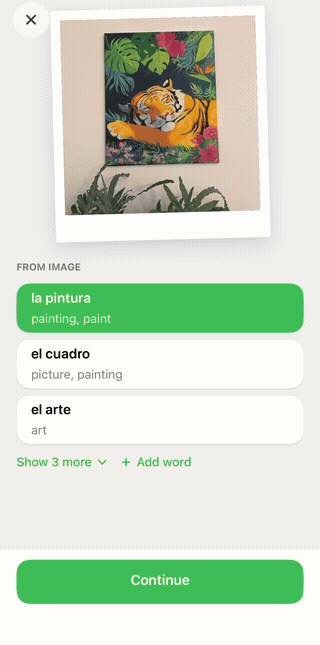

# Word Hunter

Word Hunter is a Spanish vocabulary app built as a photography scavenger hunt. Point your camera at something. The app reads any text in the scene, recognises the objects, and offers you the Spanish words for what it found. Whatever you keep becomes a polaroid that pairs the photo with the word and the place you found it.

**Winner, Apple Swift Student Challenge 2026** · iOS 18+ · SwiftUI + SwiftData · 11.5k lines · no network, no accounts

<p align="center">
  
  
</p>

## Architecture

### Scan pipeline

Each scan is passed through an OCR recognizer, an image classification model and an LLM pipeline. The three recognisers return at very different speeds. Image classification comes back in a fraction of the time `.accurate` OCR needs, and the language model is substantially slower. [`ScanPipeline`](App/Scan/ScanPipeline.swift) therefore runs them as separate stages, and the result sheet renders each one as it arrives instead of waiting for the slowest.

The camera view behind the sheet is never torn down. A single `DataScannerViewController` lives for the lifetime of the app, and the tab shell is a `ZStack` whose tabs toggle opacity and hit-testing rather than being inserted and removed. Swapping them conditionally would stop and restart the camera on every tab change, which is slow enough to be visible.

### Ranking and display

The logic to visualize the output of the three classifiers is defined with two questions. What order should the words appear in, and how many of them should be visible before the "Show N more" button. [`CandidateRanker`](App/Scan/ResultRanking/CandidateRanker.swift) handles the first and [`DisplayStrategy`](App/Scan/ResultRanking/DisplayStrategy.swift) handles the second. [`ScanPipeline`](App/Scan/ScanPipeline.swift) pairs one of each per section, so objects and text can be treated differently.

**Ordering.** Apple's classifier often returns high-confidence labels that nobody wants to collect, such as `structure` or `adult`. [`DerankedClassificationRanker`](App/Scan/ResultRanking/DerankedClassificationRanker.swift) multiplies each label's confidence by a per-label weight between 0.3 and 1.0 before sorting.

The weights are **a smoothed empirical prior from a small pilot, not a trained model.** [`ClassificationLogger`](App/Intelligence/ClassificationLogger.swift) appends one JSONL line per save, recording the top 50 raw labels alongside what the user actually picked. [`derive_weights.py`](External/derive_weights.py) reads that log and computes, for every label that appeared in the top 10:

```
p̂ = (picks + p_global · M) / (exposures + M)        w = clamp(p̂ / p_global, 0.3, 1.0)
```

The shipped `weights.json` covers 136 labels drawn from 490 exposures and 31 selections, a global pick rate of 6.3%, with `M = 12`. Smoothing that heavily is a deliberate response to the sample size. A label seen only a handful of times barely moves away from neutral. The script never boosts a label above 1.0, and any label it has not seen stays there.

Recognised text gets its own ranker. [`OCRRanker`](App/Scan/ResultRanking/CandidateRanker.swift) scores each word by the square root of its bounding-box area. Size on screen is a reasonable proxy for what the user was pointing the camera at, and taking the square root stops one very large banner from crowding out every heading below it. Words of three letters or fewer take a 0.8× penalty, since most of them turn out to be articles or OCR fragments.

**How many to show.** Objects always show three. Vision returns one good reading of the scene followed by a long tail of ever more generic labels, so the labels worth showing sit at the top, and there are about as many of them in every photo.

Text varies far more. Most photos merely contain text, such as a street name somewhere in a wider scene, and two words is the right amount to show. Some photos *are* text, such as a menu or a poster, and two words is nowhere near enough. [`AdaptiveOCRDisplayStrategy`](App/Scan/ResultRanking/DisplayStrategy.swift) therefore decides per scan, scoring how text-heavy the photo is out of three signals:

- how much of the frame the recognised text covers, worth half the score and maxing out at roughly 30% coverage
- how many words resolved against the lexicon, worth the other half and maxing out at eight
- whether the classifier called the scene something like `menu` or `poster`, worth a bonus 0.25

Score above 0.75 and the section shows eight words, otherwise two. The bonus is deliberately too small to cross the threshold on its own: a `poster` label lowers the bar, but the text in the photo still has to supply most of the evidence. If both text measurements max out, they reach the threshold without any help from the classifier.

### What the language model is for

The image classifier produces nouns. After photographing a dog, what a learner still lacks is words describing its appearance and how to interact with it. The LLM prompt therefore asks for verbs and adjectives only, and explicitly rules out further nouns. 

Every suggestion is then resolved through the lexicon before it reaches the screen, so anything invented fails to resolve and is dropped.

### Lexicon

A learner who photographs *novedades* should collect *la novedad*. Without lemmatisation every inflection becomes a separate entry and the collection fills up with near-duplicates. The app bundles its own SQLite lexicon of 24,892 Spanish words and 152,166 forms, with AI-generated translations, and treats the lemma as identity. `WordItem` is `#Unique` on language plus lemma, so a rescan merges into the word that already exists.

### Achievement celebration

The unlock reveal in [`AchievementUnlockScreen`](App/UI/Achievements/AchievementUnlockScreen.swift) is driven by a single scalar `t`, animated linearly from 0 to 3.6 seconds. A `Derived` struct maps that one value onto roughly 30 animated properties, among them the greyscale image warming, the circular colour reveal at 1.7 s, and the title entrance. Seven cubic-bézier curves baked into 256-sample lookup tables shape the timing.

<p align="center">
  
</p>

## Accessibility

Dynamic Type is supported with layout adaptation rather than just larger text. At accessibility sizes the achievement grid drops to a single column and the category grid respaces itself. Buttons grow, and the scan sheet moves each saved-count badge below its word instead of beside it.

Increased Contrast switches the category background to a darker tone and adds visible strokes to selected rows. Reduce Motion disables every non-essential animation, including the card flip and the polaroid tilt, and skips the polaroid development entirely.

Under VoiceOver the flip and tilt gestures are removed, and each card reads out its full state instead. The unlock screen is marked modal, with focus moved first to the announcement and then to the Continue button. Category boxes carry Voice Control labels for both the Spanish word and its translation.

Two screens make opposite trade-offs on purpose. `CollectionScreen` favours clarity, giving each word a row with its photo, Spanish term and English translation all visible at once. `CategoryView` favours motivation, showing a grid of mostly empty boxes that fill in as you collect, at the cost of hiding word details behind a tap. Accessibility and gamification want different things here, and the two screens answer that differently.

## Running it

Open `Package.swift` in **Xcode 16+** and run on an **iOS 18+** device. Contextual suggestions require iOS 26 on an Apple Intelligence-capable device. Everything else behaves the same without them. On first launch, choosing **Preloaded** starts you with a populated collection and some achievements already unlocked.

In the **Simulator** the app falls back to Demo Mode, and it is worth being precise about what that replaces. `VNClassifyImageRequest` does not run on the Simulator, so [`DemoScanSource`](App/Scan/ImageSources/DemoScanSource.swift) replays real classification output previously recorded on a device, covering four scenes with 50 labels each. Everything else runs live against the demo image, including OCR, ranking, lexicon resolution, persistence and (on iOS 26) the language model. A scene picker appears at the top right of the scan tab.

## License

MIT. See [LICENSE](LICENSE). Third-party components are listed in [THIRD_PARTY_NOTICES.md](THIRD_PARTY_NOTICES.md), covering ZIPFoundation, the tab-bar segmented control and the Caveat typeface.
